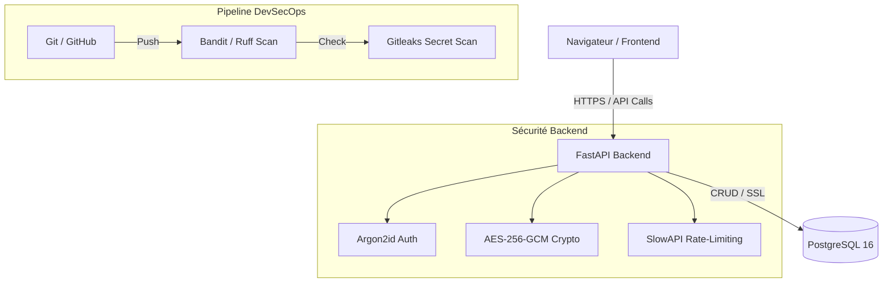

# SecureNotes - Projet Fil Rouge DevSecOps

## Description
SecureNotes est une application web moderne et hautement sécurisée conçue pour le stockage et la gestion de notes confidentielles. Ce projet met en œuvre les principes du cycle de vie du développement sécurisé (S-SDLC).

## Architecture (Simplifiée)

- **Frontend :** HTML/JS statique (Client-side encryption/decryption)
- **Backend :** FastAPI (Python 3.12)
- **Database :** PostgreSQL 16 (Hébergé par Docker)
- **Sécurité :** Argon2id (Auth), AES-256 (Chiffrement), SlowAPI (Rate-limiting).

## Pipeline DevSecOps (GitHub Actions)
- **SAST (Static Analysis Security Testing):** Bandit, Ruff.
- **Secret Scanning :** Gitleaks.
- **DCA (Dynamic Content Analysis):** Pytest security focus.

## Installation & Lancement
### Prérequis
- Docker Desktop
- Python 3.12+ (local)

### Lancement avec Docker (Recommandé)
1.  Clonage du projet : `git clone <repo-url>`
2.  Configuration `.env` (si non existant).
3.  Lancement : `./run_dev.sh` ou `docker-compose up --build`

### Documentation Complète
- [Cahier des Charges Sécurité](docs/cahier_des_charges_securite.md)
- [Analyse des Risques (EBIOS)](docs/analyse_risques_ebios.md)
- [Backlog Sécurité & DoD](docs/backlog_securite.md)
- [Tableau de bord KPI/KRI](docs/kpi_kri_dashboard.md)
